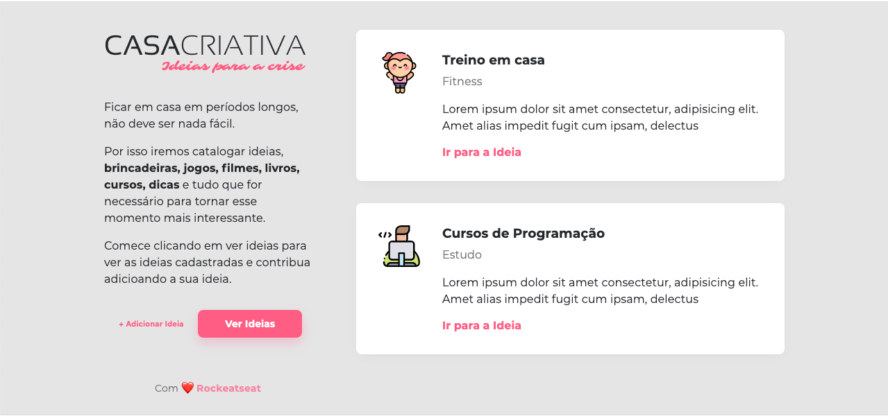
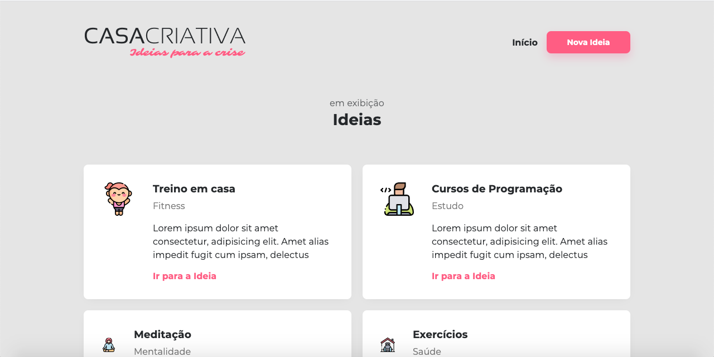
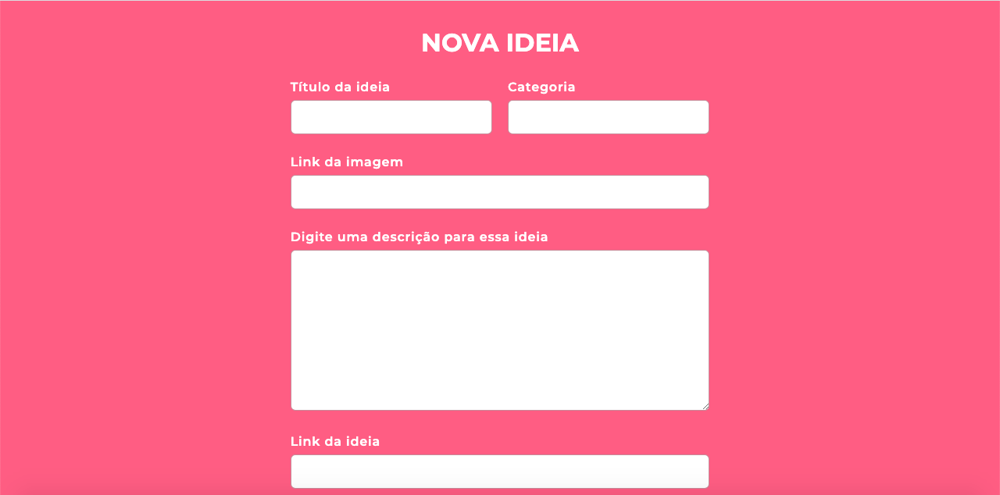

<h1 align="center">
    
</h1>

<h4 align="center">
  🚀 WorkshopDev - Semana OmniStack 11.0
</h4>

  <a href="#rocket-tecnologias">Tecnologias</a>&nbsp;&nbsp;&nbsp;|&nbsp;&nbsp;&nbsp;
  <a href="#-projeto">Projeto</a>&nbsp;&nbsp;&nbsp;|&nbsp;&nbsp;&nbsp;
  <a href="#-layout">Layout</a>&nbsp;&nbsp;&nbsp;|&nbsp;&nbsp;&nbsp;

 

## :rocket: Tecnologias

Esse projeto foi desenvolvido com as seguintes tecnologias:

- [Node.js](https://nodejs.org/en/)
- [SQLite](https://www.sqlite.org/index.html)
- [Express](https://expressjs.com/pt-br/)
- HTML
- CSS

## 💻 Projeto

A aplicação surgiu com o objetivo de ajudar pessoas a poderem ter onde guardar suas ideias de uma maneira amigável e simples.

## 🔖 Layout

  

  

  

---

Feito com 💜 by Tiago Pereira :wave: [Me encontre no Linkedin!](https://www.linkedin.com/in/sipereira/)
